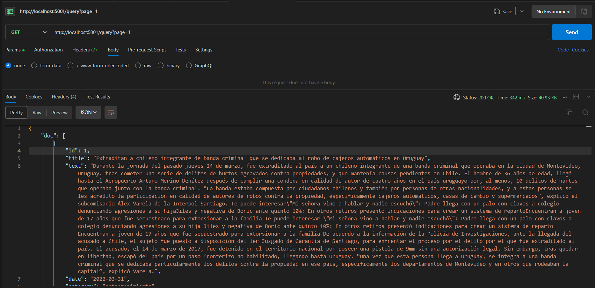

# DocLoc

## Introducción

DocLoc es una API hecha en Python que se ejecuta en la versión 3.10 o superior, construida con [FastAPI](https://fastapi.tiangolo.com/) y [uvicorn](https://www.uvicorn.org/) para gestionar y ofrecer datos estructurados de manera eficiente. Esta documentación te guiará a través de los pasos de instalación y el funcionamiento de la API.

## Instalación

### Pasos para configurar el ambiente virtual

1. Crea un ambiente virtual

```
python -m venv api
```

2. Activa el ambiente virtual

En Windows

```
api\Scripts\activate
```

En macOS y Linux

```
api/bin/activate
```

3. Instala las dependencias

```
pip install -r requirements.txt
```

4. Desactivar el ambiente virtual (para cuando termines de ejecutarlo)

```
deactivate
```

## Ejecutar la API

Para poner en marcha la API, utiliza el siguiente comando:

```bash
uvicorn main:app --reload
```

Si esto no funciona, puedes intentar lo siguiente:

```bash
python -m uvicorn main:app --reload
```

## Estructura de Carpetas

- **config**: En esta carpeta esta la conexión a la base de datos, los archivos .sql para configurar la base de datos y el dockerfile de la base de datos.
- **controllers**: En esta carpeta esta la logica que ejecutan las rutas, como por ejemplo el funcionamiento entre los distintos objetos.
- **google**: En esta carpeta se encuentra la clase encargada de realizar las solicitudes a la API de GoogleMaps.
- **gpt**: En esta carpeta se encuentra la clase encargada de realizar solicitudes a la API de GPT y las pruebas realizadas a este objeto.
- **models**: En esta carpeta se encuentran las clases que representan las tablas de la base de datos que maneja el ORM.
- **providers**: Aquí se gestionan las conexiones a la base de datos y los esquemas para las clases, así como las transformaciones de datos en la base de datos.
- **routes**: En esta sección se definen las rutas de la API y se asocian con las clases correspondientes.
- **schemas**: En esta carpeta se definen los clases usadas por la API.
- **utils**: En esta carpeta se encuetran la función auxiliar encargada de transforma arreglos de objetos en formato JSON.

## Solicitud a la API

La API maneja datos estructurados con el siguiente formato:

```json
[
  {
    "title": "string",
    "text": "string",
    "date": "string",
    "category": "string",
    "url": "string"
  }
]
```

## Ejemplo de solicitud a la API


### Ruta query

#### URL
```
http://localhost:5001/query?page=1
```

#### Postman



### Ruta geolocalize


#### URL
```
http://localhost:5001/geolocalize
```

#### Postman


#### JSON usado

```json
[{
    "title": "Pronóstico de lluvia para el fin de semana: Revisa las zonas en las que se esperan precipitaciones",
    "date": "May 31, 2023 @ 20:00:00.000",
    "text": "De acuerdo al reporte de la Dirección Meteorológica de Chile, se espera que distintas zonas del país se vean afectadas por precipitaciones durante este fin de semana, incluyendo el viernes 2 de junio. Es específico, se trataría de 11 regiones en total en las que se presentaría el fenómeno, incluyendo a la zona insular de la región de Valparaíso. Ir a la siguiente nota Según el organismo, en la zona insular de la región de Valparaíso, en Isla de Pascua, se espera lluvia en la noche del sábado y toda la jornada del domingo. También se esperan precipitaciones para este viernes en la zona continental de la región de Valparaíso, donde se harían presente durante la mañana y la tarde. El mismo día, en la región Metropolitana, el fenómeno se presentaría en la tarde y en la noche, mientras que en O'Higgins comenzaría en la mañana y terminaría en la noche. Para la región de Maule se pronostica lluvia desde la madrugada hasta la tarde de este 2 de junio, al igual que en Ñuble, donde también caerían chubascos desde la tarde del sábado hasta la madrugada del domingo. En tanto, En Biobío el pronóstico apunta en la madrugada y mañana del viernes, y desde la mañana hasta el resto de la jornada del sábado. Las precipitaciones se harían presente en La Araucanía en la madrugada, tarde y noche del 2 de junio, y desde la madrugada hasta la tarde del día siguiente. Para Los Ríos se espera que el fenómeno se haga presente todo el viernes y el sábado, al igual que en Los Lagos, donde también se extendería en la noche del domingo. Se espera que en la región de Aysén caiga agua-nieve en la madrugada del 2 de junio, mientras que la lluvia se presentaría en la tarde y en la noche. Al día siguiente se registrarían nevadas hasta la mañana y chubascos el resto de la jornada. Finalmente, el domingo, las precipitaciones ocurrirían en la tarde y en la noche. En la región de Magallanes, en Torres del Paine, caerían chubascos desde la madrugada hasta la tarde del viernes. El 3 de junio habría chubascos de agua-nieve en la mañana y en la tarde, y chubascos de niev en la noche; mientras que el domingo la lluvia se registraría en la tarde y en la noche. En tanto, Punta Arenas presentaría precipitaciones en la madrugada, mañana y noche del viernes, además de la noche del domingo. Todo sobre El Tiempo",
    "category": "",
    "url": "https://www.meganoticias.cl/nacional/415732-lluvia-fin-de-semana-santiago-regiones-pronostico-del-tiempo-25-05-2023.html"
}]
```

## Base de Datos

Para gestionar la base de datos, necesitas instalar [SQLAlchemy](https://www.sqlalchemy.org/):

```bash
pip install SQLAlchemy
```

## Referencias

- Puedes encontrar una estructura de API y router con FastAPI de Python en este [enlace](https://kb.rolosa.com/estructura-apirouter-con-fastapi-de-python/).

## Dockerización

### Construir una Imagen Docker

Para crear una imagen Docker de la aplicación, ejecuta el siguiente comando:

```bash
docker build -t docloc .
```

### Ejecutar la Imagen Docker

Luego, puedes ejecutar la imagen Docker en el puerto 5001:

```bash
docker run -p 5001:5001 docloc
```

## Dockerizar MySQL

Si necesitas una base de datos MySQL en un contenedor Docker, puedes utilizar el siguiente comando:

```bash
docker run -d --rm --name mysqldocLoc -e MYSQL_ROOT_PASSWORD=5123123123 -e MYSQL_DATABASE=storedb -p 3308:3308 mariadb
```
