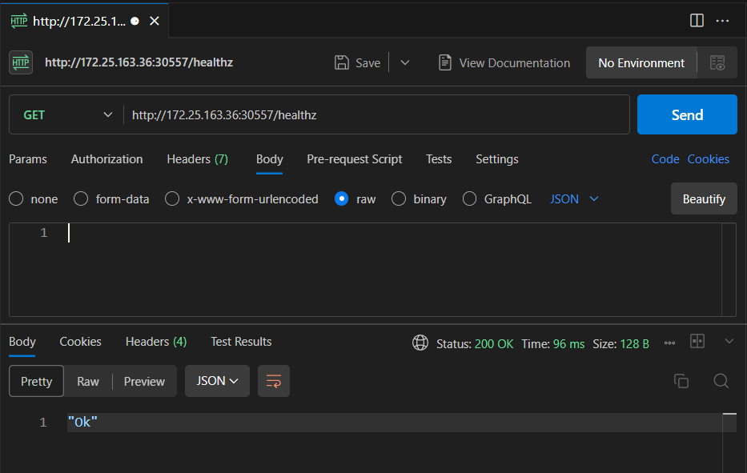
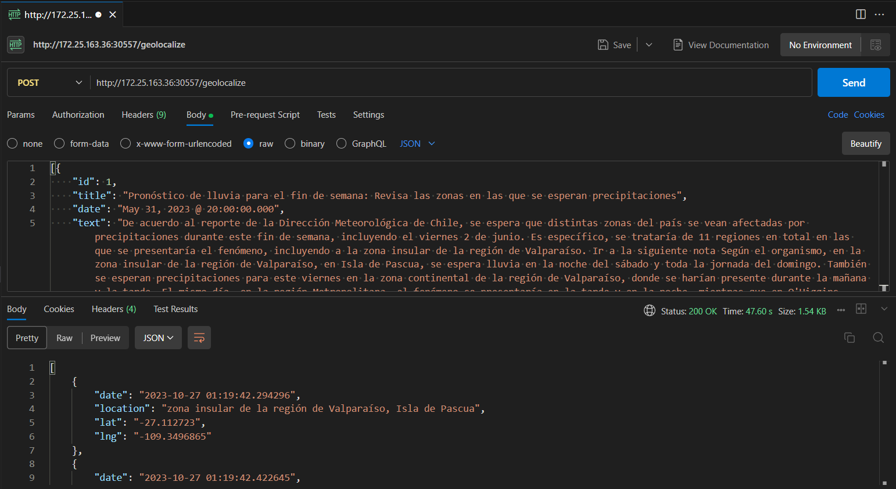

# Terraform Installation and Usage

This repository contains the IoC and code used by DocLoc.

## Prerequisites

Make sure you have the following installed on your system:

- [Terraform](https://www.terraform.io/downloads.html)

## Installing Terraform

1. Download the latest version of Terraform from the official website: [Terraform Downloads](https://www.terraform.io/downloads.html).

### Verify that Terraform has been installed successfully by running the following command:

```
terraform --version
```

## Using Terraform


1. Clone this repository:

```
git clone git@github.com:imnotUrban/DocLoc.git
cd DocLoc
```

2. Initialize the Terraform project:

```
terraform init
```
3. Create a plan to preview the changes Terraform will make to your infrastructure:

```
terraform plan
```

4. Apply the changes to your infrastructure:
```
terraform apply
```
Confirm the action by typing "yes" when prompted.

Terraform will provision the resources defined in your code.

5. To destroy the provisioned resources, you can use the following command:

```
terraform destroy
```

Confirm the action by typing "yes" when prompted.

# Test API

## Using localhost as the Host Address
You can use "localhost" as the host address to access a FastAPI service in a Kubernetes cluster when your host is Windows or Linux.

## Finding the Host IP in WSL

If you are using Windows Subsystem for Linux (WSL), you can obtain the host's IP address by following these steps:

1. Open your WSL terminal.

2. Run the following command to get the IP address associated with the "eth0" interface:

```
ip addr show eth0 | grep inet | awk '{ print $2; }' | sed 's/\/.*$//'
```
This command will display the host's IP address.

## Obtaining the NodePort

To access the FastAPI service, you need to obtain the NodePort assigned to the service. You can do this with the following command:

```
kubectl describe service fastapi-service
```

This command will provide details about the service, including the NodePort.

## Constructing the Host Address

To access the FastAPI service with the obtained information, construct the host address in the following format:

```
http://<Host-IP>:<NodePort>/healthz
```

Replace `<Host-IP>` with the IP address of your host, and `<NodePort>` with the NodePort value obtained from the `kubectl describe service` command. You can then use this host address to send a GET request to the FastAPI service in your Kubernetes cluster and retrieve the health status.

You can also use curl.

```
curl --max-time 10 http://<Host-IP>:<NodePort>/healthz
```

## Example GET query



## Example POST query



### JSON used

```
[{
    "id": 1,
    "title": "Pronóstico de lluvia para el fin de semana: Revisa las zonas en las que se esperan precipitaciones",
    "date": "May 31, 2023 @ 20:00:00.000",
    "text": "De acuerdo al reporte de la Dirección Meteorológica de Chile, se espera que distintas zonas del país se vean afectadas por precipitaciones durante este fin de semana, incluyendo el viernes 2 de junio. Es específico, se trataría de 11 regiones en total en las que se presentaría el fenómeno, incluyendo a la zona insular de la región de Valparaíso. Ir a la siguiente nota Según el organismo, en la zona insular de la región de Valparaíso, en Isla de Pascua, se espera lluvia en la noche del sábado y toda la jornada del domingo. También se esperan precipitaciones para este viernes en la zona continental de la región de Valparaíso, donde se harían presente durante la mañana y la tarde. El mismo día, en la región Metropolitana, el fenómeno se presentaría en la tarde y en la noche, mientras que en O'Higgins comenzaría en la mañana y terminaría en la noche. Para la región de Maule se pronostica lluvia desde la madrugada hasta la tarde de este 2 de junio, al igual que en Ñuble, donde también caerían chubascos desde la tarde del sábado hasta la madrugada del domingo. En tanto, En Biobío el pronóstico apunta en la madrugada y mañana del viernes, y desde la mañana hasta el resto de la jornada del sábado. Las precipitaciones se harían presente en La Araucanía en la madrugada, tarde y noche del 2 de junio, y desde la madrugada hasta la tarde del día siguiente. Para Los Ríos se espera que el fenómeno se haga presente todo el viernes y el sábado, al igual que en Los Lagos, donde también se extendería en la noche del domingo. Se espera que en la región de Aysén caiga agua-nieve en la madrugada del 2 de junio, mientras que la lluvia se presentaría en la tarde y en la noche. Al día siguiente se registrarían nevadas hasta la mañana y chubascos el resto de la jornada. Finalmente, el domingo, las precipitaciones ocurrirían en la tarde y en la noche. En la región de Magallanes, en Torres del Paine, caerían chubascos desde la madrugada hasta la tarde del viernes. El 3 de junio habría chubascos de agua-nieve en la mañana y en la tarde, y chubascos de niev en la noche; mientras que el domingo la lluvia se registraría en la tarde y en la noche. En tanto, Punta Arenas presentaría precipitaciones en la madrugada, mañana y noche del viernes, además de la noche del domingo. Todo sobre El Tiempo",
    "url": "https://www.meganoticias.cl/nacional/415732-lluvia-fin-de-semana-santiago-regiones-pronostico-del-tiempo-25-05-2023.html"
}]
```


# License


